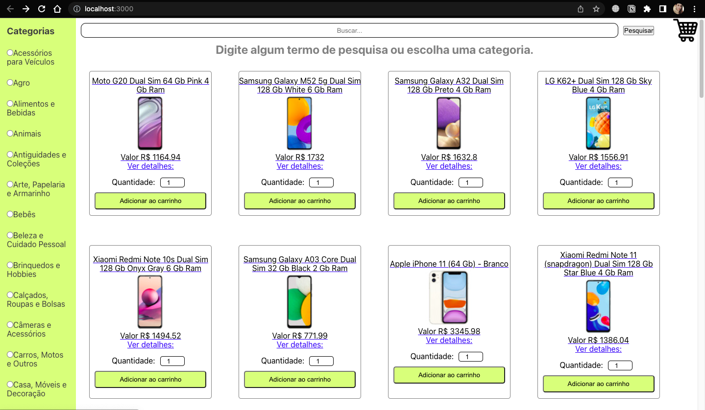

# Online Store - Front end

### Projeto realizado durante o módulo de Front-end na Trybe 💚
---
### Tecnologias utilizadas:

  
  
  

---
### Sobre o desenvolvimento:
- Os requisitos obrigatórios foram desenvolvidos em GRUPO;

### Equipe:
* [Débora Schuch](https://www.linkedin.com/in/deboraschuchdarosa/)
* [Felipe Fraxe](https://www.linkedin.com/in/felipefraxe/)
* [Guilherme Lara](https://www.linkedin.com/in/guilherme-lara-753230229/)
* [Patricia Padilha](https://www.linkedin.com/in/patricia-padilha/o)

--- 
Estilização sendo desenvolvida individualmente

